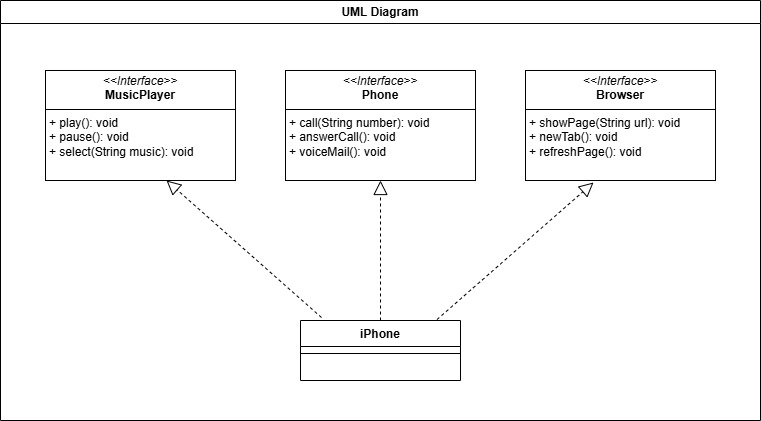

## Diagrama UML

No exercício proposto foi criado um diagrama UML que descreve a relação entre uma classe denominada iPhone com três interfaces, que representam alguns dos recursos que o dispositivo possui.

_Diagrama UML_
